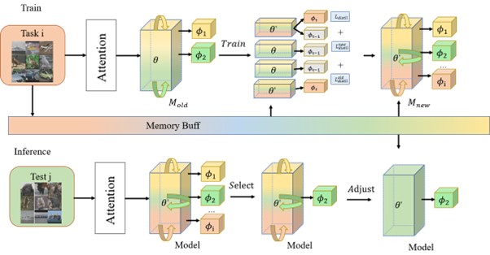

# Self-Attention-Incremental-Meta-Learning-with-Cross-Experience-Distillation 

- **
  SAIML-CED** is a mechanism designed to address the conundrum of **incremental learning**, predominantly focusing on the issue of **catastrophic forgetting**. This system primarily integrates the principles of **meta-learning and incremental learning**, thereby establishing the concept of incremental meta-learning.

  This tool offers utility in multiple domains such as image classification, natural language processing, and robotics by enabling real-time learning and prediction of dynamic data, which enhances the adaptability and practicality of the model.

  The primary features of SAIML-CED include:

  - **Dynamic Approach**: SAIML-CED mitigates the problem of catastrophic forgetting, a situation where the model forgets previously learned information when new data is introduced. It adopts an innovative approach of understanding the relationship between new and old tasks.
  - **Meta-Learning Incorporation**: SAIML-CED combines meta-learning with incremental learning, leveraging the rapid adaptation property of meta-learning to enhance the performance. A novel meta-update mechanism based on reptile optimization is designed, while decoupling the feature extraction module from the classification module to avoid degeneration of meta-updates into joint training problems.
  - **Cross-Experience Distillation**: SAIML-CED introduces cross-experience distillation as a replacement for previous knowledge distillation methods, catering to the high generalization and adaptation capabilities often required by meta-learning feature extraction modules.
  - **Interpretable Neural Network Algorithm**: SAIML-CED employs an interpretable neural network algorithm, thereby increasing the reliability of the model and enabling visualization of experimental results.
  - **Performance Enhancements**: Comparative experiments with SAIML-CED show improved image classification accuracy on datasets such as MNIST, Cifar100, ImageNet-subset, and ImageNet, demonstrating performance improvements of approximately 2%, 5%, 4%, and 8% respectively over previous methods. Furthermore, through ablation experiments, the importance of each module is evaluated, and optimal parameter selection for posterior parameters is estimated.

  In conclusion, **SAIML-CED** is an advanced and extensible system, designed with a focus on achieving incremental learning without compromising on past knowledge, thereby making it an innovative solution to the problem of catastrophic forgetting.
    
html <div align=center>  </div>


### Release History

> SAIML-CED is an ongoing project. Should you have any inquiries, feel free to create a new issue or reach out via email.
>
> > - Conducting ablation experiments
> > - Performing comparative tests

- `v0.5` Introduction of ablation experiments, evaluating the significance of each module and estimating optimal parameter selection for posterior parameters.
- `v0.4` Launch of comparative experiments to assess SAIML-CED's improved image classification accuracy on various datasets.
- `v0.3` Integration of Cross Experience Distillation (CED) into the model.
- `v0.2` Incorporation of meta-updates and self-attention mechanisms, designed to enhance learning efficiency.
- `v0.1` Initial setup of codebase and environment configuration for the SAIML-CED project.

  SAIML-CED's development trajectory reflects a continuous effort towards enhancing the capabilities of incremental learning models, with a particular emphasis on addressing the challenge of catastrophic forgetting. The version history signifies the iterative refinement of the project, revealing the progress made from initial setup to the incorporation of advanced features and extensive experimental evaluation.

#### Project Structure

```
Self-Attention-Incremental-Meta-Learning-with-Cross-Experience-Distillation-main
└─ Self-Attention-Incremental-Meta-Learning-with-Cross-Experience-Distillation-main
       ├─ Ablation Study
       │    ├─ Attention
       │    ├─ Cross Experience Distillation
       │    └─ Meta-update
       ├─ Other algorithms comparison
       │    ├─ BIC_cifar100
       │    ├─ CWR
       │    ├─ LWF-Mnist10
       │    ├─ LwF_cifar100
       │    ├─ MAS
       │    ├─ RPS
       │    ├─ RtF
       │    ├─ SI
       │    ├─ UCIR
       │    └─ iCaRL-original-ciafr100_20
       ├─ README.md
       ├─ SAIML-CED
       │    ├─ dataset
       │    ├─ main
       │    └─ net
       └─ data
              ├─ cifar10
              └─ mnist_inc
```

### Citation

Please cite our papers if you use SAIML-CED in your research.

Our Related Papers

## IL Problem

### Brife Defination


### Main Objectives

- Model Definition

$$
𝑀_𝑖=𝐹(𝑇_𝑖,𝐷_𝑚,𝑀_(𝑖−1))
$$

- Optimization target definition

$$
argmin┬{Θ_𝑡,Φ_𝑡 }  𝐿(𝑆(ϕ_𝑡;𝐹(θ_𝑡;𝑋_𝑡 )),𝑌_𝑡 )
$$

- Forgetting rate definition

$$
 argmin┬(𝛿_𝑖 ) |𝐿(𝑆(ϕ_𝑡;𝑋_𝑖 ),𝑌_𝑖 )−𝐿(𝑆(ϕ_𝑖;𝑋_𝑖 ),𝑌_𝑖 )|=𝛿_𝑖,𝑖∈(0,𝑡−1)
$$

- Accuracy Definition

$$
𝑎𝑐𝑐𝑢𝑟𝑎𝑐𝑦=  (𝑇𝑃+𝑇𝑁)/(𝑇𝑃+𝐹𝑃+𝑇𝑁+𝐹𝑁)
$$

## Implemented Algorithms

**SAIML-CED** has implemented the following algorithms:

| Name    | Title                                                        | Publication                                                  |
| ------- | ------------------------------------------------------------ | ------------------------------------------------------------ |
| EWC     | Reducing Catastrophic Forgetting in Modular Neural Networks by Dynamic Information Balancing | arXiv preprint arXiv:1912.04508                              |
| CWR     | CORe50: a New Dataset and Benchmark for Continuous Object Recognition | Conference on Robot Learning                                 |
| SI      | Three scenarios for continual learning                       | arXiv preprint arXiv:1904.07734                              |
| MAS     | Memory Aware Synapses: Learning what (not) to forget         | Proceedings of the European conference on computer vision (ECCV) |
| LWF     | Learning without Forgetting                                  | IEEE transactions on pattern analysis and machine intelligence |
| BIC 28  | Large Scale Incremental Learning                             | Proceedings of the IEEE/CVF conference on computer vision and pattern recognition |
| ICARL 6 | iCaRL: Incremental Classifier and Representation Learning    | Proceedings of the IEEE/CVF conference on computer vision and pattern recognition |
| UCIR 54 | Learning a Unified Classifier Incrementally via Rebalancing  | Proceedings of the IEEE/CVF conference on computer vision and pattern recognition |
| RtF 55  | Generative replay with feedback connections as a general strategy for continual learning | arXiv preprint arXiv:1809.10635                              |
| RPS 56  | Random Path Selection for Incremental Learning               | arXiv preprint                                               |
| SAM 14  | Self-Attention Meta-Learner for Continual Learning           | arXiv preprint arXiv:2101.12136                              |
| WA 26   | Maintaining Discrimination and Fairness in Class Incremental Learning | Proceedings of the IEEE/CVF conference on computer vision and pattern recognition |
| MUC 57  | More Classifiers, Less Forgetting: A Generic Multi-classifier Paradigm for Incremental Learning | Computer Vision--ECCV 2020: 16th European Conference, Glasgow, UK, August 23--28, 2020, Proceedings, Part XXVI 16 |

## Quick Start

The structure of this framework are still optimized steadily. We will construct the first version of the document as soon as possible until stability is ensured.

Follow the steps outlined below to quickly get started with the SAIML-CED project.

### Environment Setup

Before running SAIML-CED, make sure to set up an environment compatible with incremental learning and meta-learning. This typically involves installing relevant Python libraries and dependencies. The following instructions assume that Python is already installed on your system.

1. **Create a virtual environment**: Using a virtual environment can help avoid conflicts with other Python packages.

   ```
   bashCopy code
   python3 -m venv SAIML-ENV
   ```

2. **Activate the virtual environment**: The activation process differs depending on your operating system.

   For Unix or MacOS, run:

   ```
   bashCopy code
   source SAIML-ENV/bin/activate
   ```

   For Windows, run:

   ```
   cmdCopy code
   .\SAIML-ENV\Scripts\activate
   ```

3. **Install necessary Python libraries**: While inside the activated environment, install necessary libraries.

   ```
   bashCopy code
   pip install numpy torch torchvision scikit-learn pandas matplotlib
   ```

### Running SAIML-CED

After setting up the environment, proceed to run the SAIML-CED application as follows:

1. **Navigate to the main project directory**:

   ```
   bashCopy code
   cd Self-Attention-Incremental-Meta-Learning-with-Cross-Experience-Distillation-main/Self-Attention-Incremental-Meta-Learning-with-Cross-Experience-Distillation-main
   ```

2. **Navigate to the SAIML-CED sub-directory**:

   ```
   bashCopy code
   cd SAIML-CED
   ```

3. **Run the main application**:

   ```
   bashCopy code
   python main/main.py
   ```

Once you execute the command, SAIML-CED will start running, and you should be able to see the outputs directly in your console.

**Note**: This quick start guide assumes that you have all the necessary permissions to install Python packages and run Python scripts. Depending on the exact configuration of your system, you may need to use `sudo` (on Unix systems) or run your command shell as Administrator (on Windows).

